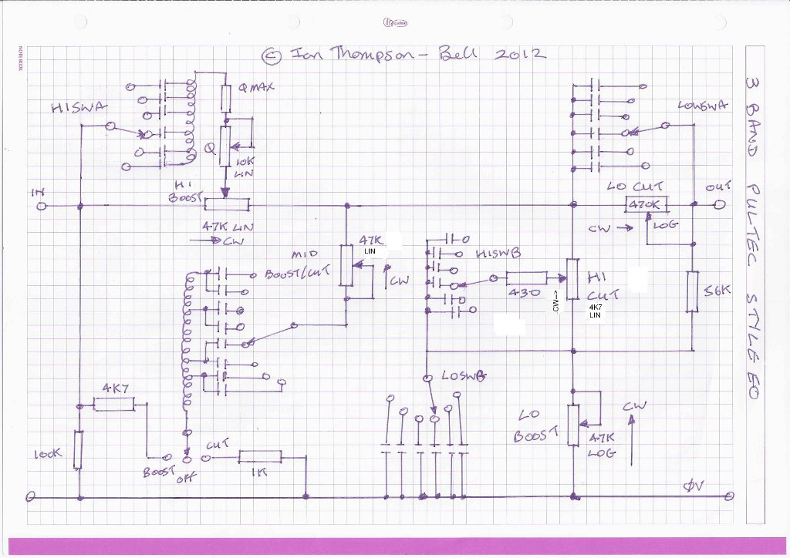

# Multi-Channel Preamp

## Description
Currently experimental KiCAD-based PCB project for a multi-channel vacuum tube preamp with insertable EQ.

## Layout
* `/src` where all the stuff is.
* `/src/schematics` where the KiCAD files live.
* `/src/schematics/build` where the KiCAD output files go. These are not under VC.
* `/src/schematics/610-output` example schematic from UA 610 preamp.
* `/src/gyraf-output` example preamp output stage from gyraf suitable for driving output transformer.
* `/src/multi-channel-preamp` schematics for the actual preamp.
* `/src/pmillett-output` example tube mic preamp schematic from pmillett.
* `/src/pultec-boost-high` prototype schematic & PCB for pultec-style high boost (from [Ian Thompson-Bell's Pultec 3 Band EQ](https://drive.google.com/drive/folders/0B_n67A1hN3qtfnhqS002NUo2WF9OTkZONDNqc3RBTS05SFlWLU4tbWItYVlZc01zejdrbGM?resourcekey=0-kD50Ger3JRaC0WO6iRfwKg)).
* `/src/pultec-cut-high` prototype schematic & PCB for pultec-style high cut (from [Ian Thompson-Bell's Pultec 3 Band EQ](https://drive.google.com/drive/folders/0B_n67A1hN3qtfnhqS002NUo2WF9OTkZONDNqc3RBTS05SFlWLU4tbWItYVlZc01zejdrbGM?resourcekey=0-kD50Ger3JRaC0WO6iRfwKg))
* `/src/pultec-three-band-eq` prototype schematic & PCB for full pultec-style 3-band eq (from [Ian Thompson-Bell's Pultec 3 Band EQ](https://drive.google.com/drive/folders/0B_n67A1hN3qtfnhqS002NUo2WF9OTkZONDNqc3RBTS05SFlWLU4tbWItYVlZc01zejdrbGM?resourcekey=0-kD50Ger3JRaC0WO6iRfwKg))

* `tapeop-output` example tube mic preamp schematic from TapeOp.
